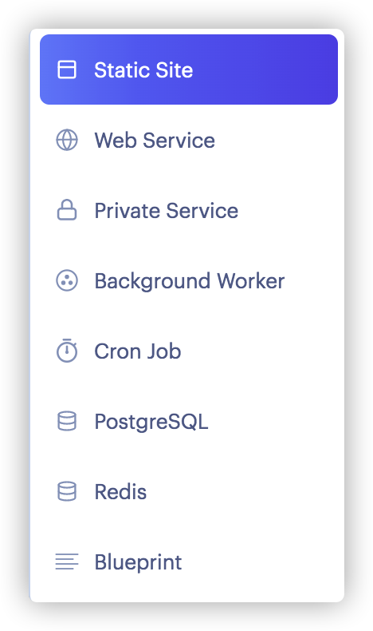
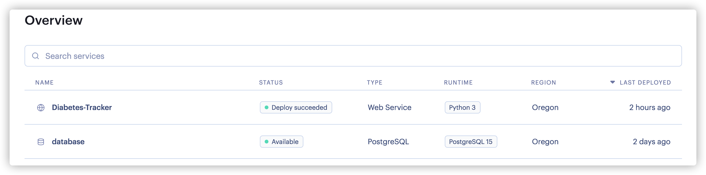
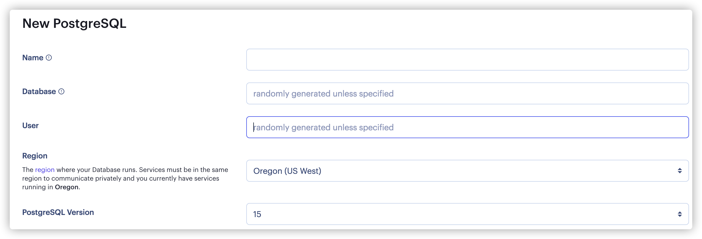
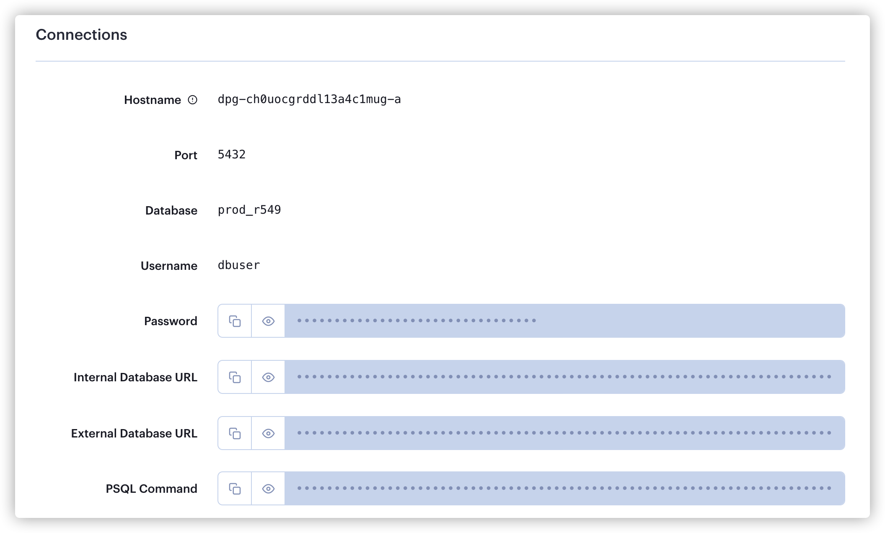
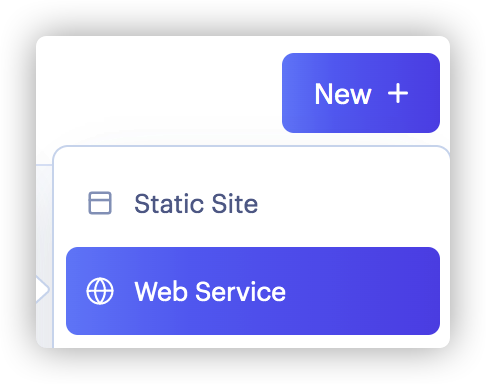
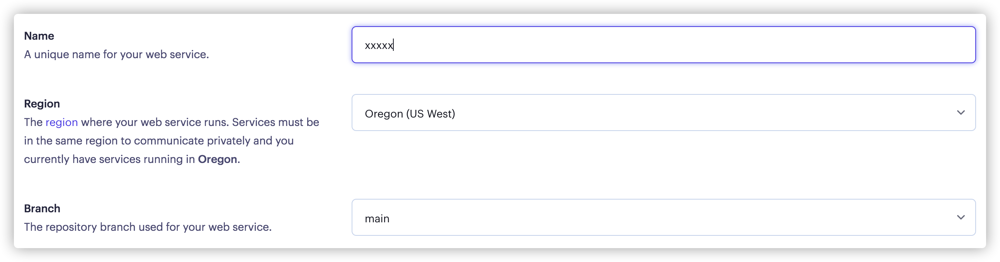
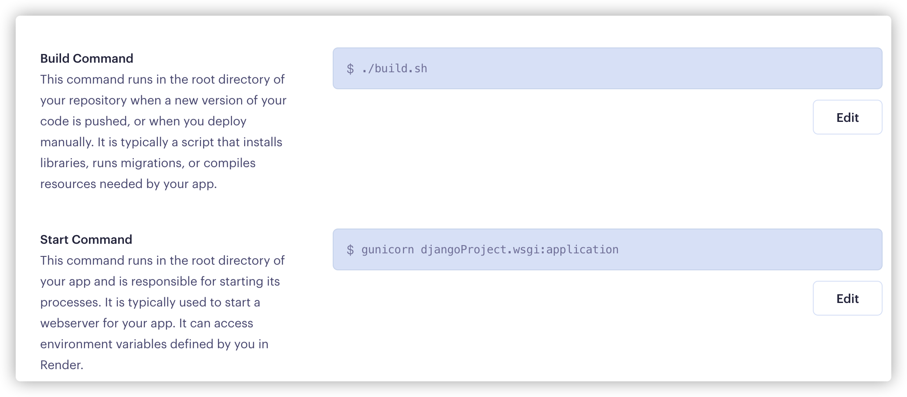
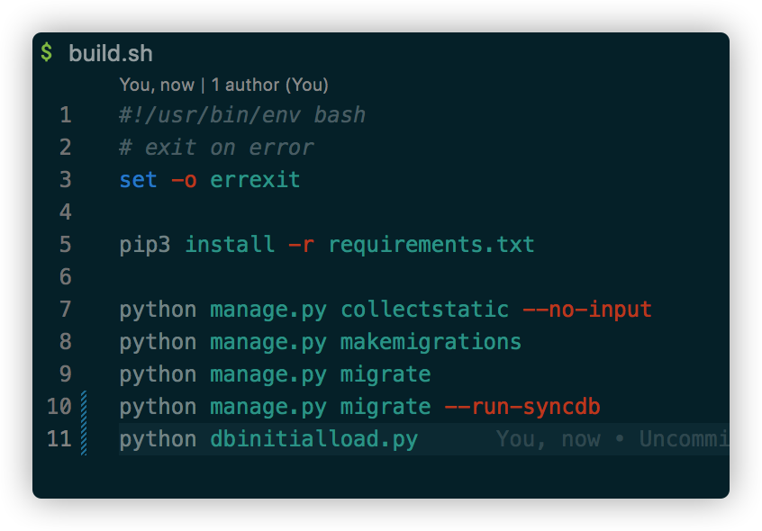
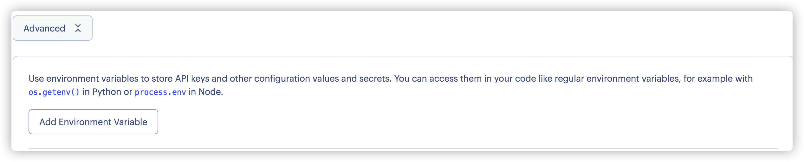

> This section is for deploying on ***web server*** only, if you need instruction for how to run locally, please refer to [Technical and User Manual.md](./Technical%20and%20User%20Manual.md)
## Deployment on Render.com
We chose Render.com as our preferred platform over others such as Heroku.com, Google Firebase, PythonAnywhere, and Oracle Cloud for several reasons.  
Firstly, we found that Render.com is very user-friendly and easy to use, with a simple and intuitive interface that made it easy for us to get started quickly.  
Secondly, Render.com offers a free web service plan. In addition, it also provides a free database service, which was very useful for us to keep data persistant.  
Overall, we found Render.com to be the best fit for our needs in terms of ease of use, cost-effectiveness, and functionality.  

## Services we used and current status on Render.com
There are several services Render.com provided:

Our application used `Web Service` and `PostgreSQL` provided by Render.com

## Steps for depolyment:
1. Register account on Render.com
2. Connect to Github repo where the source codes are at.
3. Create a new `PostgreSQL` service
4. Fill the `Name`, `Database`, `User` fields properly then click `Create Database` button 
5. After creating the `PostgreSQL` database, we will get some importatnt information which we need to save to `settings.py` of our application
6. Copy the `Internal Database URL` or `External Database URL` value and update the `DATABASE` section in `./djangoProject/settings.py`
7. After Database is up and running,create a new Web Service 
8. Give a unique name and select which branch on the Github repo it will connect to. 
9. In the `Build Command` field we changed the default value to our custmized build script:  Inside our own build script, we have added more commands needed for our application: 
10. In the `Start Command` field we also changed the value to fit our application.
11. Since default Python version is 3.7 (which is incompatible to Django 4) on Render.com, we need to add `PYTHON_VERSION` to `Environment Variable` in advanced settings so that when compiling, Render.com will download and compile Python version 3.11 for our application.
12. Click `Create Web Service` button, then it will compile and deploying automatically.
13. After depolying successfully, open https://diabetes-tracker.onrender.com, it will bring us to the front page of the application.
